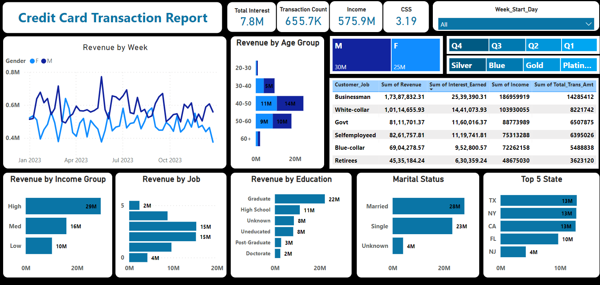
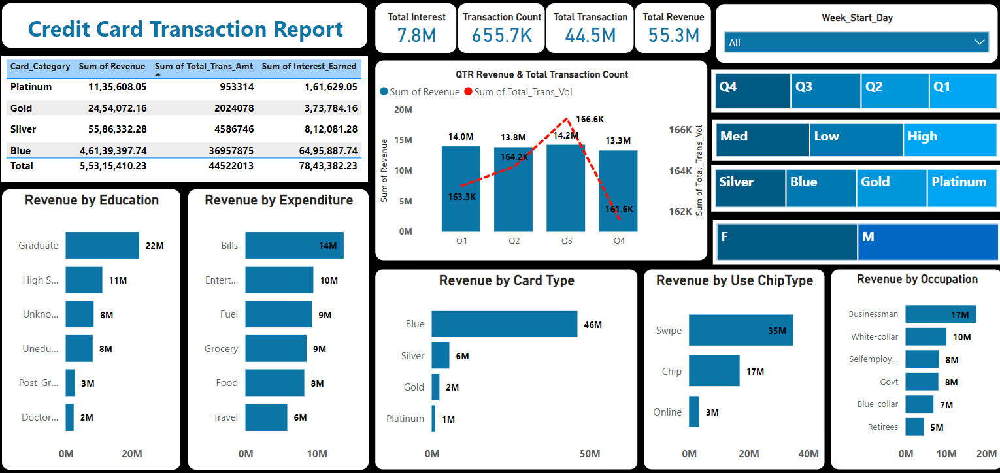

# Credit_Card_Finanacial_Dashboard
Credit card financial dashboard using Power BI 
# Project Objective
To develop a comprehensive credit 
card weekly dashboard that 
provides real-time insights into key 
performance metrics and trends, 
enabling stakeholders to monitor 
and analyze credit card operations 
effectively.
# Project Overview
• Developed an interactive dashboard using 
transaction and customer data from the SQL database, 
to provide real-time insights.   
• Streamlined data processing & analysis to monitor 
key performance metrics and trends.  
• Shared actionable insights with stakeholders based 
on dashboard findings to support decision-making 
processes.
  

